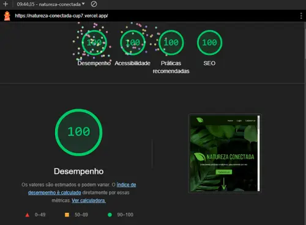
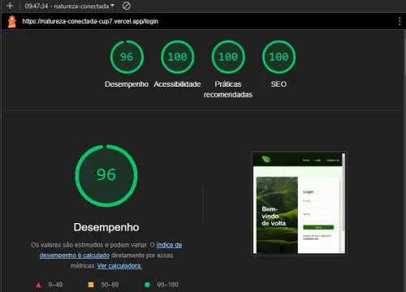
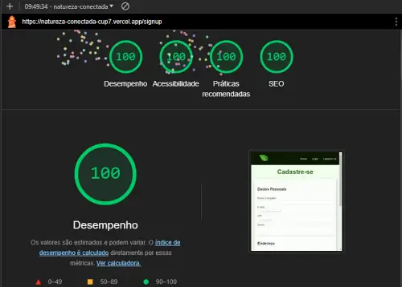
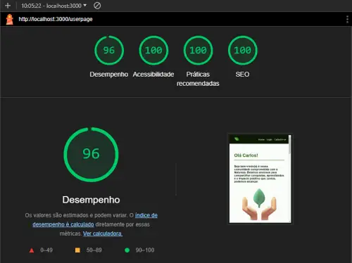

### Landing Page em React - Squad 5 

Natureza Conectada

 

Conectando pessoas à natureza, uma semente por vez.

  
***

### Desenvolvido Por:

 #### Camila Gonçalves   
  [Linkedin](https://www.linkedin.com/in/camilanpgoncalves/) | [Github](https://github.com/CamilaVerso)
 
   #### Thales Salla   
  [Linkedin](https://www.linkedin.com/in/thales-salla/) | [Github](https://github.com/thalessalla)
   
  

# Informações Importantes 

## Banco de Dados 

Estamos utilizando o *json-server* portanto para que seja possível testar o formulário de cadastro e *login* se faz necessário rodar o comando `npm run backend`

## Atualizações Task 04

Para a task 04 nos concentramos em resolver questões levantadas na correção da task 03, que foram as seguintes: 
 
 
* **Identação**;
   - Descobrimos que a extensão *Prettier* não estava funcionando como deveria.
* ***Imports* que não estavam sendo utilizados**;
   - Excluímos os *imports* que não estavam sendo utilizados.
* ***Padding* nos *inputs* de cadastro**;
   - Aumentamos o *padding* tanto nos *inputs* de cadastro quanto na tela de *login*.
* **Revisar mensagem de erro nos campos dos formulários**;
   - Melhoramos as mensagens de erro deixando-as mais informativas.
* **Formulário de *login* *logando* sem consultar os dados na *API***;
   - Modificamos a lógica para que a mesma apresentasse o comportamento esperado.
 

  Além destas modificações conseguimos utilizar o *MaterialUI* e implementamos o *menu hamburguer*.
  

## Rotas 

Ao se cadastrar ou efetuar o login, o usuário ainda não é direcionado para a *Userpage* (página de usuário), porque ainda não aprendemos sobre rotas privadas. Porém, o usuário recebe uma confirmação visual através de um alerta (*alert*).

## Responsividade

Todas as páginas são responsivas. 
Para acessar a *userpage* se faz necessário realizar a rota manualmente através da barra do navegador ou [cliando aqui.](https://natureza-conectada-cup7.vercel.app/userpage)

## Dados Lighthouse

Para alcançar os resultados reais, se faz necessário realizar o uso da ferramenta *Lighthouse* em **aba anônima**, abaixo os resultados alcançados:
 

*Landing Page*:

 
 

*Login*

 
 

*Signup*

 
 

*Userpage*

 
 

# Getting Started with Create React App

This project was bootstrapped with [Create React App](https://github.com/facebook/create-react-app).

## Available Scripts

In the project directory, you can run:

### `npm start`

Runs the app in the development mode.\
Open [http://localhost:3000](http://localhost:3000) to view it in the browser.

The page will reload if you make edits.\
You will also see any lint errors in the console.

### `npm test`

Launches the test runner in the interactive watch mode.\
See the section about [running tests](https://facebook.github.io/create-react-app/docs/running-tests) for more information.

### `npm run build`

Builds the app for production to the `build` folder.\
It correctly bundles React in production mode and optimizes the build for the best performance.

The build is minified and the filenames include the hashes.\
Your app is ready to be deployed!

See the section about [deployment](https://facebook.github.io/create-react-app/docs/deployment) for more information.

### `npm run eject`

**Note: this is a one-way operation. Once you `eject`, you can’t go back!**

If you aren’t satisfied with the build tool and configuration choices, you can `eject` at any time. This command will remove the single build dependency from your project.

Instead, it will copy all the configuration files and the transitive dependencies (webpack, Babel, ESLint, etc) right into your project so you have full control over them. All of the commands except `eject` will still work, but they will point to the copied scripts so you can tweak them. At this point you’re on your own.

You don’t have to ever use `eject`. The curated feature set is suitable for small and middle deployments, and you shouldn’t feel obligated to use this feature. However we understand that this tool wouldn’t be useful if you couldn’t customize it when you are ready for it.

## Learn More

You can learn more in the [Create React App documentation](https://facebook.github.io/create-react-app/docs/getting-started).

To learn React, check out the [React documentation](https://reactjs.org/).
